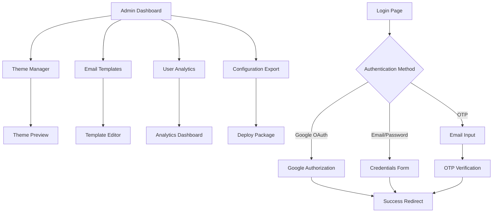

## 1. Product Overview
A white-label authentication system with 26 customizable themes, supporting Google OAuth, email/password, and OTP verification. Designed for easy resale and customization by buyers who need professional login/registration solutions for their applications. Features comprehensive theme configuration with layout variations (centered, split-left, split-right) and extensive visual customization options.

This product solves the problem of building authentication from scratch, allowing businesses to quickly deploy branded login systems without development overhead. Target market includes SaaS startups, agencies, and developers needing ready-to-sell authentication solutions.

## 2. Core Features

### 2.1 User Roles
| Role | Registration Method | Core Permissions |
|------|---------------------|------------------|
| End User | Google OAuth, Email/Password, OTP | Can authenticate, manage profile |
| Admin/Buyer | Manual setup via config file | Can customize themes, email templates, view analytics |

### 2.2 Feature Module
Our white-label authentication system consists of the following main pages:
1. **Login Page**: Theme selector, authentication form, social login buttons, modal popup support.
2. **Registration Page**: User signup form, email verification, Google OAuth integration, modal popup support.
3. **OTP Verification Page**: One-time password input, resend functionality.
4. **Admin Dashboard**: Theme customization, email template editor, user management, analytics.
5. **Email Templates**: Customizable OTP, welcome, and password reset emails.
6. **Auth Modals**: Login and Registration forms available as popup modals overlaying any page.

### 2.3 Page Details
| Page Name | Module Name | Feature description |
|-----------|-------------|---------------------|
| Login Page | Theme Selector | Dropdown to switch between 26 pre-built themes with live preview, layout variations (centered/split), and instant visual updates. |
| Login Page | Authentication Form | Email/password fields, remember me checkbox, forgot password link, real-time validation with error states. |
| Login Page | Social Login | Google OAuth button with customizable branding. |
| Login Page | Error Handling | Red border indicators, shake animations, clear error messages for wrong credentials, email validation errors. |
| Registration Page | Signup Form | Email, password, confirm password fields with validation, duplicate email detection. |
| Registration Page | Email Verification | Send OTP to email address for account verification. |
| Registration Page | Google Registration | One-click registration using Google account. |
| Registration Page | Error Handling | Inline validation, "Email already in use" messages, password strength indicators. |
| Auth Modals | Modal Container | Overlay popup with backdrop blur, close on escape/click outside. |
| Auth Modals | Form Integration | Same forms as standalone pages but in modal context. |
| Auth Modals | Error States | Same error handling as standalone pages with modal-specific positioning. |
| OTP Verification Page | Code Input | 6-digit code input with auto-focus on fields. |
| OTP Verification Page | Resend Functionality | Resend OTP button with cooldown timer. |
| Admin Dashboard | Theme Manager | Preview and select from 26 themes, customize layout types, colors, fonts, and background assets with real-time preview. |
| Admin Dashboard | Email Templates | WYSIWYG editor for OTP, welcome, and reset emails. |
| Admin Dashboard | User Analytics | View registered users, login attempts, theme usage stats. |
| Admin Dashboard | Configuration Export | Generate configuration files for easy deployment. |

## 3. Core Process

### End User Flow:
1. User lands on login page with default theme applied
2. User can switch themes using dropdown selector (changes apply instantly)
3. User chooses authentication method (Google OAuth, Email/Password, or OTP)
4. For email registration: enters details, receives OTP via email, verifies account
5. For Google OAuth: clicks button, authorizes via Google, account created automatically
6. Upon successful authentication, user is redirected to buyer's specified redirect URL

### Admin/Buyer Flow:
1. Access admin dashboard via secure route
2. Browse and preview 25 available themes
3. Select primary theme and customize colors/fonts
4. Edit email templates using visual editor
5. Configure SMTP settings for email delivery
6. Export configuration package for deployment
7. Monitor user registrations and authentication metrics

## 4. User Interface Design

### 4.1 Design Style
- **Primary Colors**: Customizable per theme (Modern: #2563eb, Retro: #dc2626, Minimalist: #000000)
- **Secondary Colors**: Complementary palette automatically generated
- **Button Style**: Rounded corners (8px radius), subtle shadows, hover animations
- **Fonts**: Inter for modern themes, Courier for retro, Helvetica for minimalist
- **Layout**: Card-based with glassmorphism effects, responsive grid system
- **Icons**: Heroicons library with theme-appropriate styling
- **Animations**: Smooth transitions (300ms), micro-interactions on hover/focus, shake animation for errors (500ms), modal fade-in (200ms)

### 4.2 Page Design Overview
| Page Name | Module Name | UI Elements |
|-----------|-------------|-------------|
| Login Page | Theme Selector | Floating dropdown with theme previews, color swatches, live preview capability. |
| Login Page | Auth Card | Centered card with blur backdrop, 400px max-width, subtle border glow, red error borders with shake animation. |
| Registration Page | Form Container | Multi-step form with progress indicator, inline validation messages, email availability check. |
| OTP Page | Code Input | 6 separate input fields with auto-tab, numeric keyboard on mobile. |
| Admin Dashboard | Sidebar Nav | Collapsible sidebar with icon navigation, active state highlighting. |
| Admin Dashboard | Theme Grid | 7x5 grid of theme cards with hover previews, quick apply buttons, category filters. |
| Auth Modals | Modal Overlay | Semi-transparent backdrop with blur effect, centered modal with 500px max-width. |
| Auth Modals | Error Display | Inline error messages below fields, toast notifications for system errors. |

### 4.3 Responsiveness
- Desktop-first design with mobile breakpoints at 768px and 480px
- Touch-optimized inputs with appropriate tap targets (minimum 44px)
- Responsive typography scaling from 16px base to 14px on mobile
- Collapsible navigation for admin dashboard on tablets and mobile
- OTP inputs automatically switch to numeric keyboard on mobile devices

### 4.4 Theme Categories
### 4.5 Theme System
The 26 themes support multiple layout configurations:

**Layout Types:**
- **Centered**: Login card centered on page (Default, Black and White, Minimal, Modern, Material, SaaS, Flat, Soft, Mono, Zen, Elegant, Vivid)
- **Split-Left**: Image on left, login form on right (Galaxy, Luxe, Retro, Neon, Pixel, Prism, Aurora, Crystal, Matrix, Orbit, Neo, Silver, Xenon)
- **Split-Right**: Image on right, login form on left (Custom configurations)
- **Full-Bg**: Full background image with overlay form (Premium variants)

**Theme Categories:**
1. **Professional** (8 themes): Default, Modern, Material, SaaS, Flat, Mono, Elegant, Silver
2. **Minimal** (5 themes): Black and White, Minimal, Soft, Zen, Neo
3. **Creative** (6 themes): Galaxy, Luxe, Retro, Neon, Pixel, Prism
4. **Premium** (7 themes): Nova, Vivid, Aurora, Crystal, Matrix, Orbit, Xenon
5. **Modern Collection** (5 themes): Glassmorphism, Neumorphism, Flat Design, Material You, Brutalist
6. **Retro Collection** (5 themes): 80s Neon, 90s Gradient, Y2K Metallic, Pixel Art, Vaporwave
7. **Minimalist Collection** (5 themes): Monochrome, Line Art, Negative Space, Swiss Design, Japanese Zen
8. **Corporate Collection** (5 themes): Professional Blue, Healthcare Green, Finance Gold, Tech Startup, Government
9. **Creative Collection** (5 themes): Artistic Brush, Watercolor, Geometric, Organic Shapes, Holographic

Each theme includes predefined color palettes, typography, component styles, and background assets that can be further customized through the admin dashboard.

## 5. Multi-Stack Strategy

### 5.1 Variant Overview
The white-label authentication system will be available in 5 distinct technology stack variants, allowing buyers to choose their preferred backend solution while maintaining identical UI/UX across all versions.

### 5.2 Available Variants

| Variant | Technology Stack | Database | Key Features |
|---------|------------------|----------|--------------|
| **Variant 1 (Primary)** | Next.js + Prisma + PostgreSQL | PostgreSQL | Full ORM support, type safety, migrations |
| **Variant 2** | Next.js + Mongoose + MongoDB | MongoDB | NoSQL flexibility, document-based storage |
| **Variant 3** | Next.js + Drizzle + MySQL | MySQL | Lightweight ORM, SQL-first approach |
| **Variant 4** | Next.js + Supabase | PostgreSQL | Built-in auth, real-time subscriptions |
| **Variant 5** | Next.js + Firebase | Firestore | Serverless, real-time sync, hosting included |

### 5.3 Shared Components
All variants share identical:
- **Frontend UI**: React components, themes, layouts, and styling
- **Authentication Logic**: OAuth providers, OTP system, validation rules
- **Admin Dashboard**: Theme management, configuration tools, analytics
- **Email Templates**: Responsive email designs and content
- **API Contracts**: Consistent endpoint structure and response formats

### 5.4 Variant-Specific Features
- **Database Models**: Adapted to each database's strengths and constraints
- **Query Optimization**: Leveraging native database features for performance
- **Deployment Guides**: Specific instructions for each stack's hosting requirements
- **Migration Tools**: Database-specific backup and restore utilities

### 5.5 Development Priority
1. **Phase 1**: Complete Variant 1 (Next.js + Prisma + PostgreSQL) as the reference implementation
2. **Phase 2**: Port to Variants 2-5 maintaining feature parity
3. **Phase 3**: Create unified documentation and deployment guides for all variants

### 5.6 Buyer Benefits
- **Choice**: Select the technology stack that matches existing infrastructure
- **Consistency**: Same professional UI/UX regardless of backend choice
- **Flexibility**: Easy migration between variants if requirements change
- **Support**: Comprehensive documentation for each technology combination