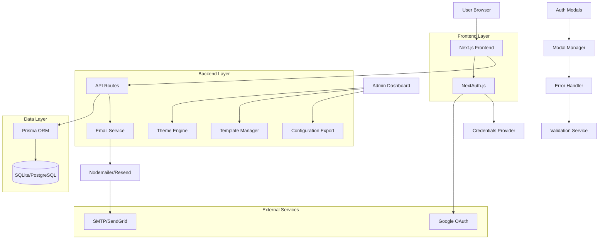
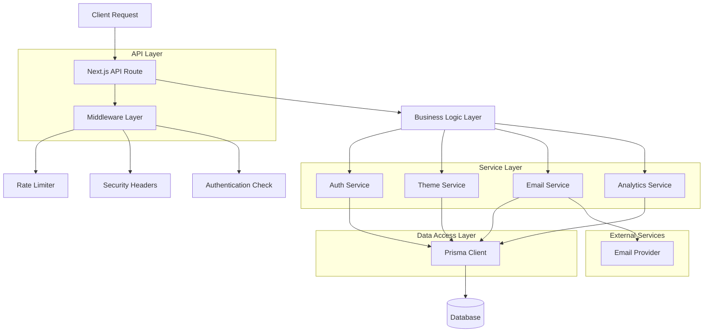
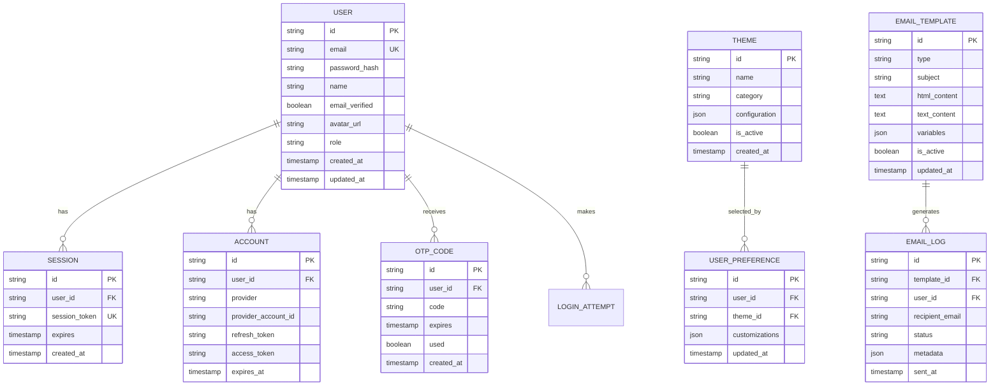
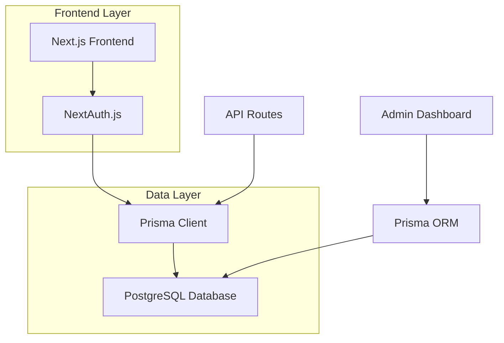
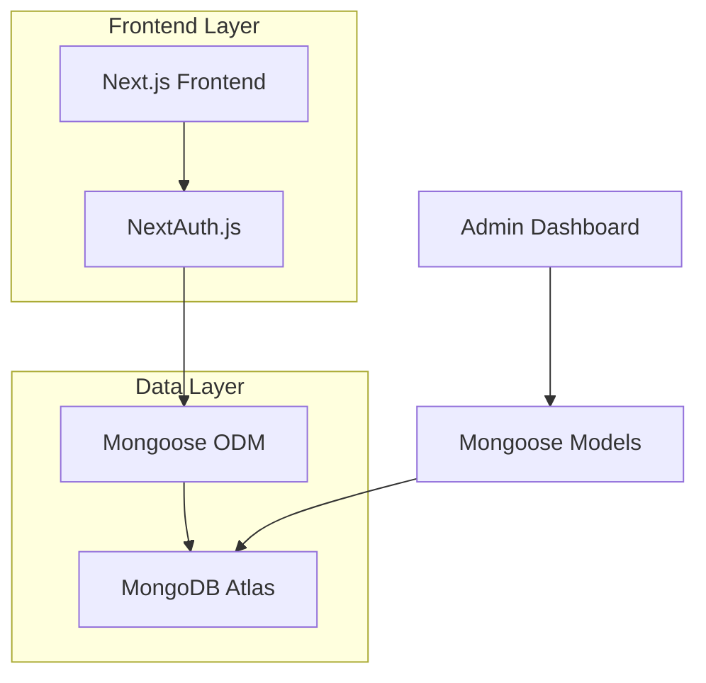
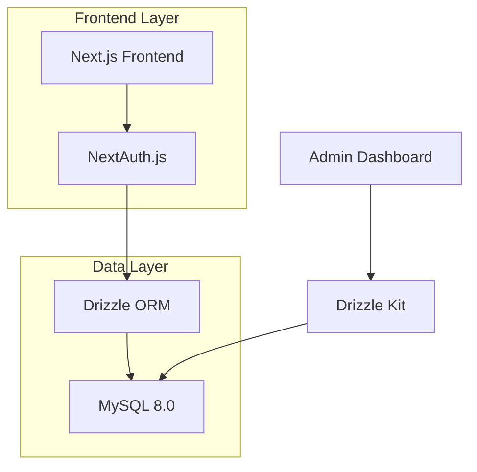
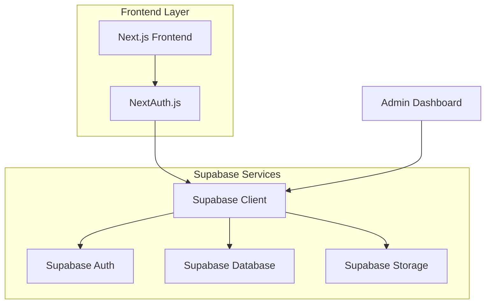
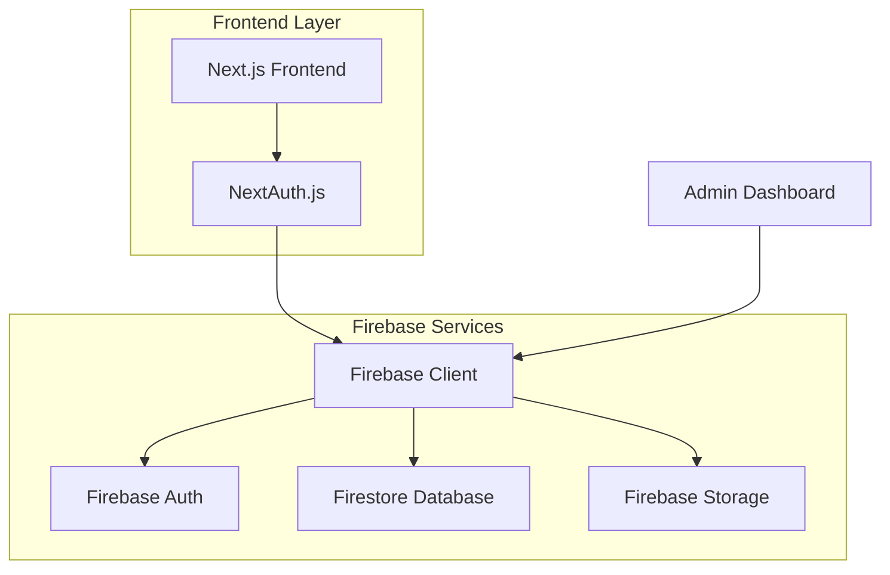

## 1. Architecture design



## 2. Technology Description

* **Frontend**: Next.js 14 (App Router) + React 18 + TypeScript

* **Styling**: Tailwind CSS 3 + PostCSS

* **Authentication**: NextAuth.js 4

* **Database**: Prisma ORM with SQLite (development) / PostgreSQL (production)

* **Email Service**: Nodemailer (SMTP) / Resend API

* **State Management**: React Context + SWR for data fetching

* **Form Validation**: React Hook Form + Zod

* **Modal System**: Headless UI + Framer Motion

* **Error Handling**: React Error Boundary + Toast Notifications

* **Security**: Rate limiting with express-rate-limit, helmet for security headers

* **Initialization Tool**: create-next-app

## 3. Route definitions

| Route                 | Purpose                              |
| --------------------- | ------------------------------------ |
| /                     | Login page with theme selector       |
| /auth/register        | User registration page               |
| /auth/verify          | OTP verification page                |
| /auth/forgot-password | Password reset request               |
| /auth/reset-password  | New password setup                   |
| /modal/login          | Login modal popup                    |
| /modal/register       | Registration modal popup             |
| /admin                | Admin dashboard (protected)          |
| /admin/themes         | Theme customization interface        |
| /admin/emails         | Email template editor                |
| /admin/analytics      | User analytics dashboard             |
| /admin/settings       | SMTP and system configuration        |
| /api/auth/\*          | NextAuth.js authentication endpoints |
| /api/auth/register    | User registration API                |
| /api/auth/verify-otp  | OTP verification API                 |
| /api/auth/resend-otp  | Resend OTP API                       |
| /api/admin/users      | User management API                  |
| /api/admin/themes     | Theme configuration API              |
| /api/admin/emails     | Email template API                   |
| /api/admin/export     | Configuration export API             |

## 4. API definitions

### 4.1 Authentication APIs

**User Registration**

```
POST /api/auth/register
```

Request:

| Param Name | Param Type | isRequired | Description            |
| ---------- | ---------- | ---------- | ---------------------- |
| email      | string     | true       | User email address     |
| password   | string     | true       | Password (min 8 chars) |
| name       | string     | false      | Full name (optional)   |
| theme      | string     | false      | Selected theme ID      |

Response:

| Param Name  | Param Type | Description                     |
| ----------- | ---------- | ------------------------------- |
| success     | boolean    | Registration status             |
| message     | string     | Status message                  |
| userId      | string     | Created user ID                 |
| otpRequired | boolean    | Whether OTP verification needed |

**OTP Verification**

```
POST /api/auth/verify-otp
```

Request:

| Param Name | Param Type | isRequired | Description        |
| ---------- | ---------- | ---------- | ------------------ |
| email      | string     | true       | User email address |
| otp        | string     | true       | 6-digit OTP code   |

Response:

| Param Name  | Param Type | Description             |
| ----------- | ---------- | ----------------------- |
| success     | boolean    | Verification status     |
| token       | string     | JWT token if successful |
| redirectUrl | string     | Redirect destination    |

### 4.2 Admin APIs

**Theme Configuration**

```
PUT /api/admin/themes/:themeId
```

Request:

| Param Name     | Param Type | isRequired | Description           |
| -------------- | ---------- | ---------- | --------------------- |
| primaryColor   | string     | false      | Primary theme color   |
| secondaryColor | string     | false      | Secondary theme color |
| fontFamily     | string     | false      | Font family selection |
| customCSS      | string     | false      | Custom CSS overrides  |

**Email Template Update**

```
PUT /api/admin/emails/:templateType
```

Request:

| Param Name  | Param Type | isRequired | Description        |
| ----------- | ---------- | ---------- | ------------------ |
| subject     | string     | true       | Email subject line |
| htmlContent | string     | true       | HTML email body    |
| textContent | string     | false      | Plain text version |
| variables   | object     | false      | Template variables |

## 5. Server architecture diagram



## 6. Data model

### 6.1 Data model definition



### 6.2 Data Definition Language

**User Table (users)**

```sql
-- create table
CREATE TABLE users (
    id TEXT PRIMARY KEY DEFAULT (lower(hex(randomblob(16)))),
    email TEXT UNIQUE NOT NULL,
    password_hash TEXT,
    name TEXT,
    email_verified BOOLEAN DEFAULT FALSE,
    avatar_url TEXT,
    role TEXT DEFAULT 'user' CHECK (role IN ('user', 'admin')),
    created_at TIMESTAMP DEFAULT CURRENT_TIMESTAMP,
    updated_at TIMESTAMP DEFAULT CURRENT_TIMESTAMP
);

-- create indexes
CREATE INDEX idx_users_email ON users(email);
CREATE INDEX idx_users_role ON users(role);
```

**Theme Configuration Schema**

```typescript
interface ThemeConfiguration {
  layout: {
    type: 'centered' | 'split-left' | 'split-right' | 'full-bg';
    backgroundImage?: string;
    overlayOpacity?: number;
  };
  colors: {
    primary: string;
    secondary: string;
    accent: string;
    background: string;
    text: string;
    border: string;
    success: string;
    error: string;
    warning: string;
  };
  typography: {
    fontFamily: string;
    fontSize: {
      xs: string;
      sm: string;
      base: string;
      lg: string;
      xl: string;
      '2xl': string;
    };
    fontWeight: {
      normal: number;
      medium: number;
      semibold: number;
      bold: number;
    };
  };
  components: {
    borderRadius: {
      sm: string;
      md: string;
      lg: string;
      xl: string;
    };
    shadows: {
      sm: string;
      md: string;
      lg: string;
      xl: string;
    };
    glassmorphism?: {
      enabled: boolean;
      blur: number;
      opacity: number;
    };
    neumorphism?: {
      enabled: boolean;
      lightShadow: string;
      darkShadow: string;
      depth: number;
    };
  };
  assets: {
    backgroundPattern?: string;
    loginImage?: string;
    logo?: string;
    icons: {
      google: string;
      email: string;
      lock: string;
      user: string;
    };
  };
  animations: {
    enabled: boolean;
    duration: number;
    easing: string;
    effects: string[];
    errorShake?: {
      enabled: boolean;
      intensity: number;
      duration: number;
    };
  };
  modal?: {
    backdropBlur: number;
    animationDuration: number;
    maxWidth: string;
  };
}
```

**Theme Table (themes)**

````sql
-- create table
CREATE TABLE themes (
    id TEXT PRIMARY KEY DEFAULT (lower(hex(randomblob(16)))),
    name TEXT NOT NULL,
    category TEXT NOT NULL,
    layout_type TEXT NOT NULL DEFAULT 'centered',
    configuration JSON NOT NULL,
    is_active BOOLEAN DEFAULT TRUE,
    is_premium BOOLEAN DEFAULT FALSE,
    created_at TIMESTAMP DEFAULT CURRENT_TIMESTAMP,
    updated_at TIMESTAMP DEFAULT CURRENT_TIMESTAMP
);

-- insert all 51 themes with configurations (26 original + 25 new)
INSERT INTO themes (name, category, layout_type, configuration) VALUES
-- Professional (Centered Layout)
('Default', 'professional', 'centered', '{"colors": {"primary": "#3b82f6", "secondary": "#64748b", "accent": "#06b6d4", "background": "#ffffff", "text": "#1f2937"}, "typography": {"fontFamily": "Inter"}, "components": {"borderRadius": {"md": "0.5rem"}, "shadows": {"md": "0 4px 6px -1px rgba(0, 0, 0, 0.1)"}}}'),
('Modern', 'professional', 'centered', '{"colors": {"primary": "#2563eb", "secondary": "#475569", "accent": "#8b5cf6", "background": "#f8fafc", "text": "#0f172a"}, "typography": {"fontFamily": "Inter"}, "components": {"borderRadius": {"lg": "0.75rem"}, "glassmorphism": {"enabled": true, "blur": 8}}}'),
('Material', 'professional', 'centered', '{"colors": {"primary": "#1976d2", "secondary": "#424242", "accent": "#ff4081", "background": "#fafafa", "text": "#212121"}, "typography": {"fontFamily": "Roboto"}, "components": {"borderRadius": {"sm": "0.25rem"}, "shadows": {"md": "0 2px 4px rgba(0,0,0,0.2)"}}}'),
('SaaS', 'professional', 'centered', '{"colors": {"primary": "#6366f1", "secondary": "#64748b", "accent": "#ec4899", "background": "#ffffff", "text": "#1e293b"}, "typography": {"fontFamily": "Inter"}, "components": {"borderRadius": {"lg": "0.75rem"}, "shadows": {"lg": "0 10px 15px -3px rgba(0, 0, 0, 0.1)"}}}'),
('Flat', 'professional', 'centered', '{"colors": {"primary": "#3498db", "secondary": "#7f8c8d", "accent": "#e74c3c", "background": "#ecf0f1", "text": "#2c3e50"}, "typography": {"fontFamily": "Lato"}, "components": {"borderRadius": {"none": "0px"}, "shadows": {"none": "none"}}}'),
('Mono', 'professional', 'centered', '{"colors": {"primary": "#374151", "secondary": "#6b7280", "accent": "#dc2626", "background": "#f9fafb", "text": "#111827"}, "typography": {"fontFamily": "JetBrains Mono"}, "components": {"borderRadius": {"md": "0.375rem"}, "shadows": {"sm": "0 1px 2px 0 rgba(0, 0, 0, 0.05)"}}}'),
('Elegant', 'professional', 'centered', '{"colors": {"primary": "#1f2937", "secondary": "#6b7280", "accent": "#d97706", "background": "#fefefe", "text": "#111827"}, "typography": {"fontFamily": "Playfair Display"}, "components": {"borderRadius": {"xl": "1rem"}, "shadows": {"xl": "0 20px 25px -5px rgba(0, 0, 0, 0.1)"}}}'),
('Silver', 'professional', 'centered', '{"colors": {"primary": "#6b7280", "secondary": "#9ca3af", "accent": "#3b82f6", "background": "#f3f4f6", "text": "#1f2937"}, "typography": {"fontFamily": "Inter"}, "components": {"borderRadius": {"lg": "0.75rem"}, "glassmorphism": {"enabled": true, "blur": 12}}}'),

-- Minimal (Centered Layout)
('Black and White', 'minimal', 'centered', '{"colors": {"primary": "#000000", "secondary": "#666666", "accent": "#ff0000", "background": "#ffffff", "text": "#000000"}, "typography": {"fontFamily": "Helvetica"}, "components": {"borderRadius": {"none": "0px"}, "shadows": {"none": "none"}}}'),
('Minimal', 'minimal', 'centered', '{"colors": {"primary": "#1a1a1a", "secondary": "#404040", "accent": "#2563eb", "background": "#fafafa", "text": "#171717"}, "typography": {"fontFamily": "Helvetica Neue"}, "components": {"borderRadius": {"sm": "0.25rem"}, "shadows": {"sm": "0 1px 2px 0 rgba(0, 0, 0, 0.05)"}}}'),
('Soft', 'minimal', 'centered', '{"colors": {"primary": "#8b5cf6", "secondary": "#a78bfa", "accent": "#ec4899", "background": "#fef7ff", "text": "#581c87"}, "typography": {"fontFamily": "Inter"}, "components": {"borderRadius": {"xl": "1rem"}, "shadows": {"md": "0 4px 6px -1px rgba(139, 92, 246, 0.1)"}}}'),
('Zen', 'minimal', 'centered', '{"colors": {"primary": "#065f46", "secondary": "#059669", "accent": "#d97706", "background": "#f0fdf4", "text": "#064e3b"}, "typography": {"fontFamily": "Noto Sans JP"}, "components": {"borderRadius": {"full": "9999px"}, "shadows": {"none": "none"}}}'),
('Neo', 'minimal', 'centered', '{"colors": {"primary": "#0f172a", "secondary": "#475569", "accent": "#6366f1", "background": "#f8fafc", "text": "#0f172a"}, "typography": {"fontFamily": "Space Grotesk"}, "components": {"borderRadius": {"lg": "0.75rem"}, "shadows": {"lg": "0 10px 15px -3px rgba(15, 23, 42, 0.1)"}}}'),

-- Creative (Split Layout)
('Galaxy', 'creative', 'split-left', '{"colors": {"primary": "#8b5cf6", "secondary": "#c084fc", "accent": "#06b6d4", "background": "#0f172a", "text": "#f8fafc"}, "typography": {"fontFamily": "Orbitron"}, "assets": {"loginImage": "/themes/galaxy-bg.jpg"}, "components": {"borderRadius": {"md": "0.5rem"}, "shadows": {"xl": "0 20px 25px -5px rgba(139, 92, 246, 0.3)"}}}'),
('Luxe', 'creative', 'split-left', '{"colors": {"primary": "#d97706", "secondary": "#f59e0b", "accent": "#dc2626", "background": "#fef3c7", "text": "#92400e"}, "typography": {"fontFamily": "Cormorant Garamond"}, "assets": {"loginImage": "/themes/luxe-bg.jpg"}, "components": {"borderRadius": {"xl": "1rem"}, "glassmorphism": {"enabled": true, "blur": 16}}}'),
('Retro', 'creative', 'split-left', '{"colors": {"primary": "#dc2626", "secondary": "#f59e0b", "accent": "#10b981", "background": "#fef2f2", "text": "#991b1b"}, "typography": {"fontFamily": "VT323"}, "assets": {"loginImage": "/themes/retro-bg.jpg"}, "animations": {"enabled": true, "effects": ["scanlines"]}}'),
('Neon', 'creative', 'split-left', '{"colors": {"primary": "#ec4899", "secondary": "#8b5cf6", "accent": "#06b6d4", "background": "#0c0a09", "text": "#f8fafc"}, "typography": {"fontFamily": "Bungee"}, "assets": {"loginImage": "/themes/neon-bg.jpg"}, "animations": {"enabled": true, "effects": ["glow"]}}'),
('Pixel', 'creative', 'split-left', '{"colors": {"primary": "#10b981", "secondary": "#3b82f6", "accent": "#f59e0b", "background": "#f0fdf4", "text": "#166534"}, "typography": {"fontFamily": "Press Start 2P"}, "assets": {"loginImage": "/themes/pixel-bg.jpg"}, "components": {"borderRadius": {"none": "0px"}}}'),
('Prism', 'creative', 'split-left', '{"colors": {"primary": "#6366f1", "secondary": "#ec4899", "accent": "#06b6d4", "background": "#faf5ff", "text": "#581c87"}, "typography": {"fontFamily": "Righteous"}, "assets": {"loginImage": "/themes/prism-bg.jpg"}, "animations": {"enabled": true, "effects": ["rainbow"]}}'),

-- Premium (Split Layout with Enhanced Features)
('Nova', 'premium', 'split-left', '{"colors": {"primary": "#0ea5e9", "secondary": "#6366f1", "accent": "#ec4899", "background": "#f8fafc", "text": "#0f172a"}, "typography": {"fontFamily": "Exo 2"}, "assets": {"loginImage": "/themes/nova-bg.jpg"}, "components": {"borderRadius": {"2xl": "1.5rem"}, "glassmorphism": {"enabled": true, "blur": 20}}}'),
('Vivid', 'premium', 'split-left', '{"colors": {"primary": "#dc2626", "secondary": "#f59e0b", "accent": "#10b981", "background": "#fef2f2", "text": "#7f1d1d"}, "typography": {"fontFamily": "Fira Sans"}, "assets": {"loginImage": "/themes/vivid-bg.jpg"}, "animations": {"enabled": true, "effects": ["particles"]}}'),
('Aurora', 'premium', 'split-left', '{"colors": {"primary": "#06b6d4", "secondary": "#8b5cf6", "accent": "#ec4899", "background": "#ecfeff", "text": "#164e63"}, "typography": {"fontFamily": "Quicksand"}, "assets": {"loginImage": "/themes/aurora-bg.jpg"}, "animations": {"enabled": true, "effects": ["aurora"]}}'),
('Crystal', 'premium', 'split-left', '{"colors": {"primary": "#3b82f6", "secondary": "#06b6d4", "accent": "#8b5cf6", "background": "#f0f9ff", "text": "#1e40af"}, "typography": {"fontFamily": "Raleway"}, "assets": {"loginImage": "/themes/crystal-bg.jpg"}, "components": {"borderRadius": {"3xl": "2rem"}, "glassmorphism": {"enabled": true, "blur": 24}}}'),
('Matrix', 'premium', 'split-left', '{"colors": {"primary": "#10b981", "secondary": "#059669", "accent": "#dc2626", "background": "#000000", "text": "#10b981"}, "typography": {"fontFamily": "Share Tech Mono"}, "assets": {"loginImage": "/themes/matrix-bg.jpg"}, "animations": {"enabled": true, "effects": ["matrix"]}}'),
('Orbit', 'premium', 'split-left', '{"colors": {"primary": "#7c3aed", "secondary": "#ec4899", "accent": "#06b6d4", "background": "#faf5ff", "text": "#581c87"}, "typography": {"fontFamily": "Titillium Web"}, "assets": {"loginImage": "/themes/orbit-bg.jpg"}, "animations": {"enabled": true, "effects": ["orbit"]}}'),
('Xenon', 'premium', 'split-left', '{"colors": {"primary": "#06b6d4", "secondary": "#8b5cf6", "accent": "#ec4899", "background": "#0c4a6e", "text": "#e0f2fe"}, "typography": {"fontFamily": "Orbitron"}, "assets": {"loginImage": "/themes/xenon-bg.jpg"}, "components": {"borderRadius": {"full": "9999px"}, "glassmorphism": {"enabled": true, "blur": 32}}},

-- Modern Collection (5 themes)
('Glassmorphism', 'modern', 'centered', '{"colors": {"primary": "#3b82f6", "secondary": "#64748b", "accent": "#06b6d4", "background": "#f8fafc", "text": "#1e293b"}, "typography": {"fontFamily": "Inter"}, "components": {"borderRadius": {"xl": "1rem"}, "glassmorphism": {"enabled": true, "blur": 20, "opacity": 0.8}}}'),
('Neumorphism', 'modern', 'centered', '{"colors": {"primary": "#6366f1", "secondary": "#8b5cf6", "accent": "#ec4899", "background": "#f1f5f9", "text": "#0f172a"}, "typography": {"fontFamily": "Inter"}, "components": {"borderRadius": {"2xl": "1.5rem"}, "neumorphism": {"enabled": true, "lightShadow": "-4px -4px 8px rgba(255,255,255,0.8)", "darkShadow": "4px 4px 8px rgba(0,0,0,0.1)", "depth": 8}}}'),
('Flat Design', 'modern', 'centered', '{"colors": {"primary": "#2563eb", "secondary": "#475569", "accent": "#dc2626", "background": "#ffffff", "text": "#1e293b"}, "typography": {"fontFamily": "Inter"}, "components": {"borderRadius": {"md": "0.5rem"}, "shadows": {"none": "none"}}}'),
('Material You', 'modern', 'centered', '{"colors": {"primary": "#6750a4", "secondary": "#7d5260", "accent": "#b3261e", "background": "#fffbfe", "text": "#1c1b1f"}, "typography": {"fontFamily": "Roboto"}, "components": {"borderRadius": {"full": "9999px"}, "shadows": {"md": "0 1px 3px rgba(0,0,0,0.12)"}}}'),
('Brutalist', 'modern', 'centered', '{"colors": {"primary": "#000000", "secondary": "#ffffff", "accent": "#ff0000", "background": "#f0f0f0", "text": "#000000"}, "typography": {"fontFamily": "Courier New"}, "components": {"borderRadius": {"none": "0px"}, "shadows": {"none": "none"}, "borderWidth": {"thick": "4px"}}}'),

-- Retro Collection (5 themes)
('80s Neon', 'retro', 'split-left', '{"colors": {"primary": "#ff0080", "secondary": "#00ff80", "accent": "#8000ff", "background": "#0a0a0a", "text": "#ffffff"}, "typography": {"fontFamily": "Bungee"}, "assets": {"loginImage": "/themes/80s-neon-bg.jpg"}, "animations": {"enabled": true, "effects": ["neon-glow", "scanlines"]}}}'),
('90s Gradient', 'retro', 'split-left', '{"colors": {"primary": "#ff6b6b", "secondary": "#4ecdc4", "accent": "#45b7d1", "background": "#f9f9f9", "text": "#2c2c2c"}, "typography": {"fontFamily": "Comic Sans MS"}, "assets": {"loginImage": "/themes/90s-gradient-bg.jpg"}, "animations": {"enabled": true, "effects": ["gradient-shift"]}}}'),
('Y2K Metallic', 'retro', 'split-left', '{"colors": {"primary": "#c0c0c0", "secondary": "#808080", "accent": "#4169e1", "background": "#f5f5f5", "text": "#2f2f2f"}, "typography": {"fontFamily": "Impact"}, "assets": {"loginImage": "/themes/y2k-metallic-bg.jpg"}, "components": {"borderRadius": {"lg": "0.75rem"}, "shadows": {"xl": "0 20px 25px -5px rgba(192, 192, 192, 0.3)"}}}}'),
('Pixel Art', 'retro', 'split-left', '{"colors": {"primary": "#00ff00", "secondary": "#ff00ff", "accent": "#ffff00", "background": "#000000", "text": "#ffffff"}, "typography": {"fontFamily": "Press Start 2P"}, "assets": {"loginImage": "/themes/pixel-art-bg.jpg"}, "components": {"borderRadius": {"none": "0px"}, "borderWidth": {"thick": "2px"}}}'),
('Vaporwave', 'retro', 'split-left', '{"colors": {"primary": "#ff71ce", "secondary": "#01cdfe", "accent": "#05ffa1", "background": "#1a0033", "text": "#ffffff"}, "typography": {"fontFamily": "VCR OSD Mono"}, "assets": {"loginImage": "/themes/vaporwave-bg.jpg"}, "animations": {"enabled": true, "effects": ["vaporwave-grid", "sunset-gradient"]}}}'),

-- Minimalist Collection (5 themes)
('Monochrome', 'minimalist', 'centered', '{"colors": {"primary": "#000000", "secondary": "#808080", "accent": "#404040", "background": "#ffffff", "text": "#000000"}, "typography": {"fontFamily": "Helvetica Neue"}, "components": {"borderRadius": {"none": "0px"}, "shadows": {"none": "none"}}}'),
('Line Art', 'minimalist', 'centered', '{"colors": {"primary": "#1a1a1a", "secondary": "#b3b3b3", "accent": "#666666", "background": "#fefefe", "text": "#0d0d0d"}, "typography": {"fontFamily": "Futura"}, "components": {"borderRadius": {"none": "0px"}, "borderWidth": {"thin": "1px"}, "shadows": {"none": "none"}}}'),
('Negative Space', 'minimalist', 'centered', '{"colors": {"primary": "#ffffff", "secondary": "#f2f2f2", "accent": "#e6e6e6", "background": "#0a0a0a", "text": "#ffffff"}, "typography": {"fontFamily": "Helvetica"}, "components": {"borderRadius": {"full": "9999px"}, "shadows": {"none": "none"}}}'),
('Swiss Design', 'minimalist', 'centered', '{"colors": {"primary": "#ff0000", "secondary": "#000000", "accent": "#ffffff", "background": "#f5f5f5", "text": "#000000"}, "typography": {"fontFamily": "Arial"}, "components": {"borderRadius": {"none": "0px"}, "shadows": {"none": "none"}, "grid": {"enabled": true}}}'),
('Japanese Zen', 'minimalist', 'centered', '{"colors": {"primary": "#2c2c2c", "secondary": "#757575", "accent": "#d32f2f", "background": "#fafafa", "text": "#212121"}, "typography": {"fontFamily": "Noto Sans JP"}, "components": {"borderRadius": {"sm": "0.25rem"}, "shadows": {"none": "none"}, "spacing": {"large": "2rem"}}}'),

-- Corporate Collection (5 themes)
('Professional Blue', 'corporate', 'centered', '{"colors": {"primary": "#1e40af", "secondary": "#3b82f6", "accent": "#06b6d4", "background": "#f8fafc", "text": "#1e293b"}, "typography": {"fontFamily": "Inter"}, "components": {"borderRadius": {"md": "0.5rem"}, "shadows": {"sm": "0 1px 2px 0 rgba(0, 0, 0, 0.05)"}}}'),
('Healthcare Green', 'corporate', 'centered', '{"colors": {"primary": "#059669", "secondary": "#10b981", "accent": "#3b82f6", "background": "#f0fdf4", "text": "#064e3b"}, "typography": {"fontFamily": "Inter"}, "components": {"borderRadius": {"lg": "0.75rem"}, "shadows": {"md": "0 4px 6px -1px rgba(0, 0, 0, 0.1)"}}}'),
('Finance Gold', 'corporate', 'centered', '{"colors": {"primary": "#d97706", "secondary": "#f59e0b", "accent": "#dc2626", "background": "#fffbeb", "text": "#92400e"}, "typography": {"fontFamily": "Inter"}, "components": {"borderRadius": {"xl": "1rem"}, "shadows": {"lg": "0 10px 15px -3px rgba(0, 0, 0, 0.1)"}}}'),
('Tech Startup', 'corporate', 'centered', '{"colors": {"primary": "#6366f1", "secondary": "#8b5cf6", "accent": "#ec4899", "background": "#eef2ff", "text": "#3730a3"}, "typography": {"fontFamily": "Inter"}, "components": {"borderRadius": {"2xl": "1.5rem"}, "shadows": {"xl": "0 20px 25px -5px rgba(0, 0, 0, 0.1)"}}}'),
('Government', 'corporate', 'centered', '{"colors": {"primary": "#1f2937", "secondary": "#374151", "accent": "#dc2626", "background": "#f9fafb", "text": "#111827"}, "typography": {"fontFamily": "Times New Roman"}, "components": {"borderRadius": {"none": "0px"}, "shadows": {"none": "none"}, "borderWidth": {"standard": "1px"}}}'),

-- Creative Collection (5 themes)
('Artistic Brush', 'creative', 'split-left', '{"colors": {"primary": "#dc2626", "secondary": "#ea580c", "accent": "#ca8a04", "background": "#fef2f2", "text": "#7f1d1d"}, "typography": {"fontFamily": "Dancing Script"}, "assets": {"loginImage": "/themes/artistic-brush-bg.jpg"}, "components": {"borderRadius": {"xl": "1rem"}, "shadows": {"md": "0 4px 6px -1px rgba(220, 38, 38, 0.1)"}}}'),
('Watercolor', 'creative', 'split-left', '{"colors": {"primary": "#3b82f6", "secondary": "#06b6d4", "accent": "#8b5cf6", "background": "#f0f9ff", "text": "#1e40af"}, "typography": {"fontFamily": "Pacifico"}, "assets": {"loginImage": "/themes/watercolor-bg.jpg"}, "components": {"borderRadius": {"3xl": "2rem"}, "shadows": {"lg": "0 10px 15px -3px rgba(59, 130, 246, 0.1)"}}}'),
('Geometric', 'creative', 'split-left', '{"colors": {"primary": "#1e293b", "secondary": "#475569", "accent": "#dc2626", "background": "#f8fafc", "text": "#0f172a"}, "typography": {"fontFamily": "Bebas Neue"}, "assets": {"loginImage": "/themes/geometric-bg.jpg"}, "components": {"borderRadius": {"none": "0px"}, "shadows": {"none": "none"}, "patterns": {"geometric": true}}}'),
('Organic Shapes', 'creative', 'split-left', '{"colors": {"primary": "#059669", "secondary": "#10b981", "accent": "#f59e0b", "background": "#f0fdf4", "text": "#064e3b"}, "typography": {"fontFamily": "Comfortaa"}, "assets": {"loginImage": "/themes/organic-shapes-bg.jpg"}, "components": {"borderRadius": {"full": "9999px"}, "shadows": {"xl": "0 20px 25px -5px rgba(5, 150, 105, 0.1)"}}}'),
('Holographic', 'creative', 'split-left', '{"colors": {"primary": "#8b5cf6", "secondary": "#ec4899", "accent": "#06b6d4", "background": "#0f172a", "text": "#f8fafc"}, "typography": {"fontFamily": "Orbitron"}, "assets": {"loginImage": "/themes/holographic-bg.jpg"}, "animations": {"enabled": true, "effects": ["holographic", "rainbow-shift"]}}}');

**Email Template Table (email_templates)**
```sql
-- create table
CREATE TABLE email_templates (
    id TEXT PRIMARY KEY DEFAULT (lower(hex(randomblob(16)))),
    type TEXT UNIQUE NOT NULL,
    subject TEXT NOT NULL,
    html_content TEXT NOT NULL,
    text_content TEXT,
    variables JSON,
    is_active BOOLEAN DEFAULT TRUE,
    updated_at TIMESTAMP DEFAULT CURRENT_TIMESTAMP
);

-- insert default templates
INSERT INTO email_templates (type, subject, html_content, text_content) VALUES
('otp', 'Your verification code', '<h1>Your OTP: {{otp}}</h1>', 'Your OTP: {{otp}}'),
('welcome', 'Welcome to our platform', '<h1>Welcome {{name}}!</h1>', 'Welcome {{name}}!'),
('reset', 'Password reset request', '<h1>Reset your password</h1>', 'Reset your password');
````

**Rate Limiting Implementation**

```sql
-- create login attempts table for rate limiting
CREATE TABLE login_attempts (
    id TEXT PRIMARY KEY DEFAULT (lower(hex(randomblob(16)))),
    email TEXT NOT NULL,
    ip_address TEXT NOT NULL,
    success BOOLEAN DEFAULT FALSE,
    created_at TIMESTAMP DEFAULT CURRENT_TIMESTAMP
);

CREATE INDEX idx_login_attempts_email ON login_attempts(email);
CREATE INDEX idx_login_attempts_ip ON login_attempts(ip_address);
CREATE INDEX idx_login_attempts_created ON login_attempts(created_at);
```

## 7. Multi-Stack Strategy

### 7.1 Variant Architecture Overview

The system supports 5 distinct technology stack variants while maintaining identical frontend UI/UX across all implementations.

### 7.2 Variant 1: Next.js + Prisma + PostgreSQL (Primary)

**Architecture**: Traditional full-stack with ORM



**Key Technologies**:

* **Database**: PostgreSQL 15+

* **ORM**: Prisma 5.x with full type safety

* **Migration**: Prisma Migrate for schema versioning

* **Connection Pooling**: PgBouncer for production

* **Backup**: pg\_dump automated backups

### 7.3 Variant 2: Next.js + Mongoose + MongoDB

**Architecture**: Document-based NoSQL approach



**Key Technologies**:

* **Database**: MongoDB 6.0+

* **ODM**: Mongoose 8.x with schema validation

* **Connection**: Native MongoDB driver with connection pooling

* **Indexing**: Compound indexes for email and provider queries

* **Backup**: MongoDB Atlas automated backups

### 7.4 Variant 3: Next.js + Drizzle + MySQL

**Architecture**: Lightweight SQL-first approach



**Key Technologies**:

* **Database**: MySQL 8.0+ or MariaDB 10.6+

* **ORM**: Drizzle ORM with type-safe queries

* **Migration**: Drizzle Kit for schema management

* **Connection**: mysql2 driver with connection pooling

* **Backup**: mysqldump automated backups

### 7.5 Variant 4: Next.js + Supabase

**Architecture**: Backend-as-a-Service with built-in features



**Key Technologies**:

* **Database**: PostgreSQL (managed by Supabase)

* **Auth**: Supabase Auth with built-in providers

* **Storage**: Supabase Storage for file uploads

* **Real-time**: Built-in real-time subscriptions

* **Edge Functions**: Serverless functions for custom logic

### 7.6 Variant 5: Next.js + Firebase

**Architecture**: Google Firebase ecosystem



**Key Technologies**:

* **Database**: Firestore (NoSQL document database)

* **Auth**: Firebase Auth with multiple providers

* **Storage**: Firebase Storage for file uploads

* **Hosting**: Firebase Hosting with CDN

* **Functions**: Cloud Functions for server-side logic

### 7.7 Shared Architecture Components

All variants maintain identical:

**Frontend Layer**:

* React components and hooks

* Theme system and UI components

* Form validation and error handling

* Modal system and animations

* Admin dashboard interface

**Authentication Flow**:

* NextAuth.js configuration

* OAuth provider integrations

* JWT token management

* Session handling

* OTP verification system

**API Contracts**:

* RESTful endpoint structure

* Request/response formats

* Error handling standards

* Rate limiting implementation

**Email System**:

* Template structure and variables

* SMTP configuration options

* Email service integrations

* Template rendering engine

### 7.8 Variant-Specific Considerations

**Database Schema Adaptations**:

* PostgreSQL: Full relational schema with foreign keys

* MongoDB: Document-based schema with embedded data

* MySQL: Optimized for MySQL-specific features

* Supabase: Leverages Row Level Security (RLS)

* Firebase: Denormalized data structure for Firestore

**Performance Optimizations**:

* PostgreSQL: Index optimization and query planning

* MongoDB: Aggregation pipelines and indexing strategies

* MySQL: Query optimization and connection pooling

* Supabase: Edge caching and CDN integration

* Firebase: Firestore indexing and query optimization

**Deployment Strategies**:

* PostgreSQL: Docker containers with managed databases

* MongoDB: MongoDB Atlas or self-hosted clusters

* MySQL: Managed MySQL services or containerized

* Supabase: Direct deployment to Supabase platform

* Firebase: Full-stack deployment to Firebase ecosystem

### 7.9 Development Roadmap

1. **Phase 1**: Complete Variant 1 (Next.js + Prisma + PostgreSQL)
2. **Phase 2**: Create database abstraction layer for shared logic
3. **Phase 3**: Implement Variants 2-5 with feature parity
4. **Phase 4**: Performance testing and optimization per variant
5. **Phase 5**: Create deployment guides and migration tools

```
```

